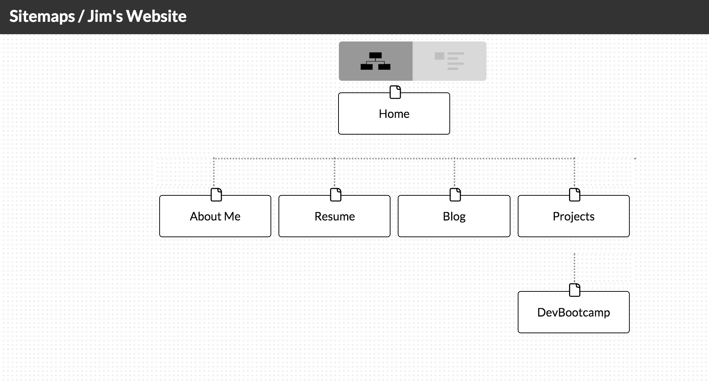

##This is my reflection for lesson 2.3: Introduction to Design and Site Planning

In this lesson we learned about the phases of web design, and started the information gathering, planning, and design phases of what will be our own website.  As part of this lesson, I have created a first draft for a sitemap for my own website, which is shown below:

##I was asked to answer the following questions:

###What are the 6 Phases of Web Design?
The 6 phases of web design according to the iDesign Studios article written by Selene Bowlby are:
 1. Information Gathering
 2. Planning
 3. Design
 4. Development
 5. Testing and Delivery
 6. Maintenance

###What is your site's primary goal or purpose? What kind of content will your site feature?
My site's primary goal will to be to advertise myself and the skills I have developed to potential employers.  It will include projects I have completed at DevBootcamp, links to my GitHub and LinkedIn profiles, and a little information about me on a personal level.

###What is your target audience's interests and how do you see your site addressing them?
My target audience will be potential employers and the goal of the site will be to sell myself to them.  My site will address this by providing information on my skills, the projects I have completed, and some personal information.

###What is the primary "action" the user should take when coming to your site? Do you want them to search for information, contact you, or see your portfolio? It's ok to have several actions at once, or different actions for different kinds of visitors.
The primary "action" is for a user to be able to simply learn about me, my skills, the projects I've worked on, and be able to contact me.

###What are the main things someone should know about design and user experience?
I would say some key things to know are:
It is not one-size fits all.  Depending on the application, some rules might not apply, or be more important than others.
User experience is not the same thing as usability.  I consider user experience to be an umbrella term that encompasses several aspects of a system.  Usability would be one aspect of the system that affects user exerience.
User experience is difficult to quantify.  We don't have a user experience meter that we can just plug in to a website to measure how satisfied a user is with what they see and experience.  There is subjectivity and an art form to make a good user friendly system.

###What is user experience design and why is it valuable?
User experience is essentially how a person feels while interfacing with a system, which could be a website, a web application, or a desktop software package.  This can be influenced by several things including: usability, performance, accessibility, utility, and overall design.

###Which parts of the challenge did you find tedious?
I didn't find the challenge to be tedious at all.  Honestly, as with most of the challenges I have done, writing the reflection was the most tedious part.
