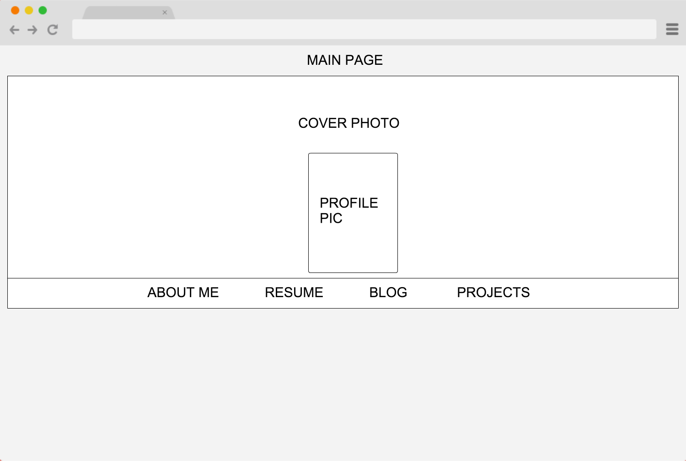
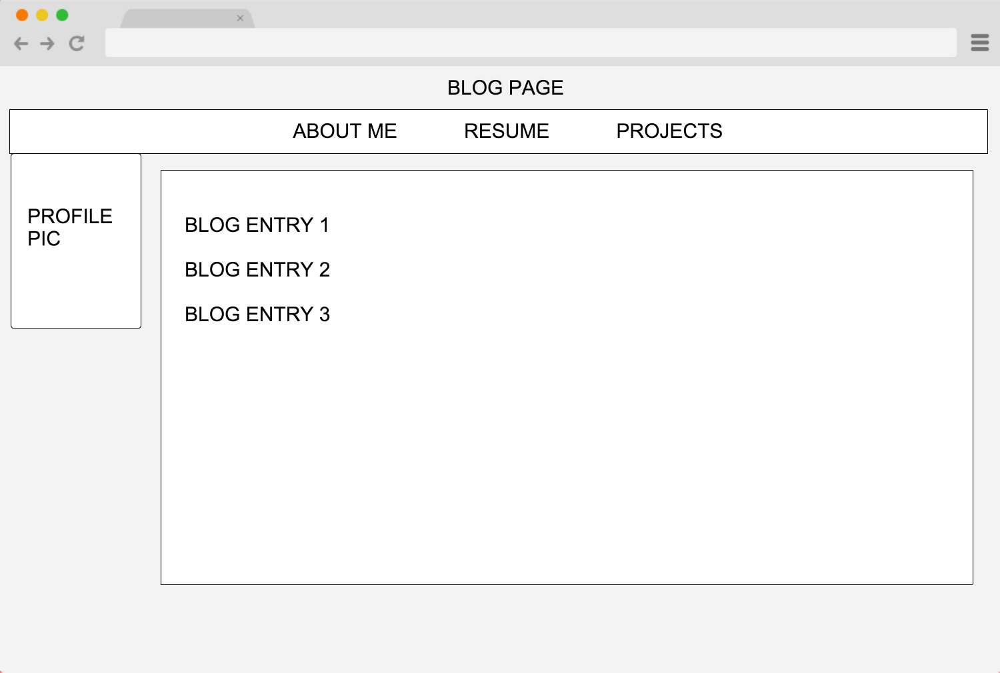

## This is my reflection entry for lesson 2.4: Wireframing

In this lesson we learned about wireframing, which is a first step to planning the layout of a webpage.  With wireframing you plan where the basic elements on your page will go.

As part of this lesson I have created wireframes of a webpage that I plan on using as a using a free online wirefram tool called Cacoo.  My wireframe sketches are below:

###I was also asked to answer the following questions in my reflection:

###What is a wireframe?
A wireframe is a sketch showing where different items will be placed on a webpage.

###What are the benefits of wireframing?
Wireframing is an important part of the planning process.  It makes it quick and easy to visualize a layout, and will make the future steps of actually creating the page easier.

###Did you enjoy wireframing your site?
I like planning and designing, so it was something that I enjoyed.

###Did you revise your wireframe or stick with your first idea?
I changed it around a little until I arrived at a basic plan and then stuck with it.

###What questions did you ask during this challenge? What resources did you find to help you answer them?
Mainly I took some time to find an online tool that would allow me to draw a wireframe.  I don't own a scanner, so I couldn't scan something if I drew it by hand.  I tried a few different tools until I found Cacoo and then stuck with that.

###Which parts of the challenge did you enjoy and which parts did you find tedious?
As usual, writing this reflection is the most tedious part for me.  The most enjoyable was planning the wireframe for the webpage, although using Cacoo was not the most enjoyable experience.  I'm sure there are better tools out there, and as with most things, it would become easier to use with experience.