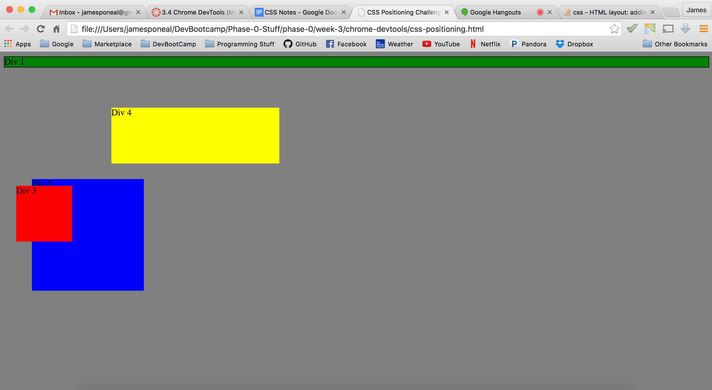
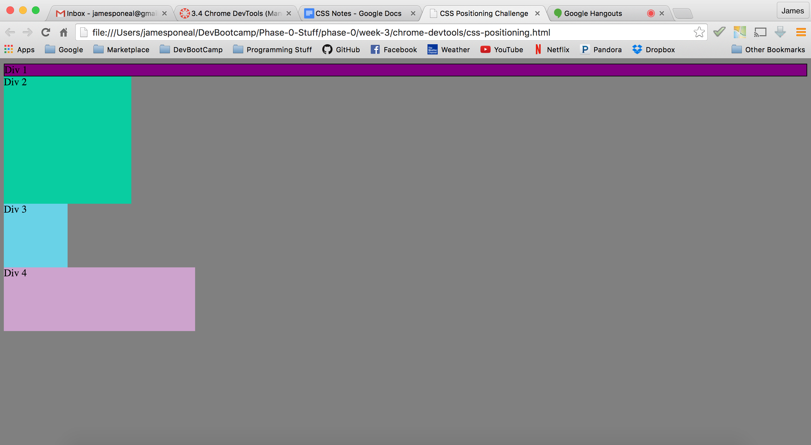
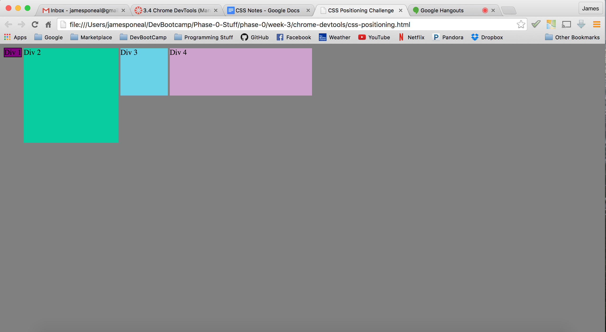
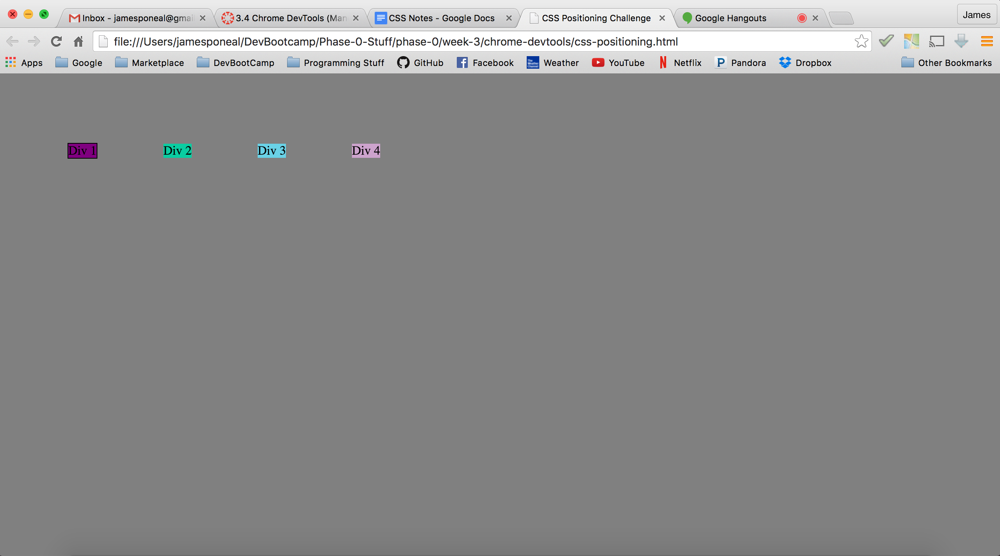
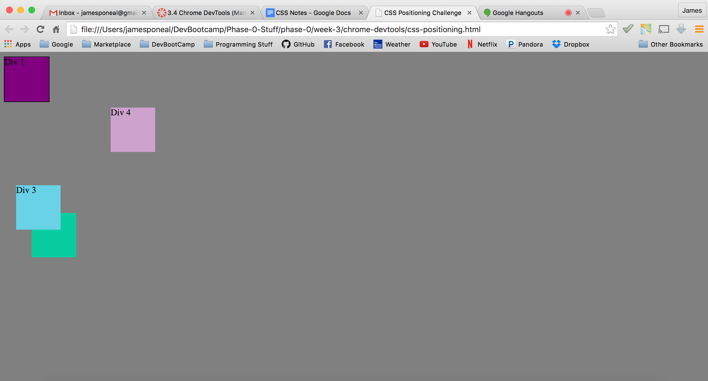
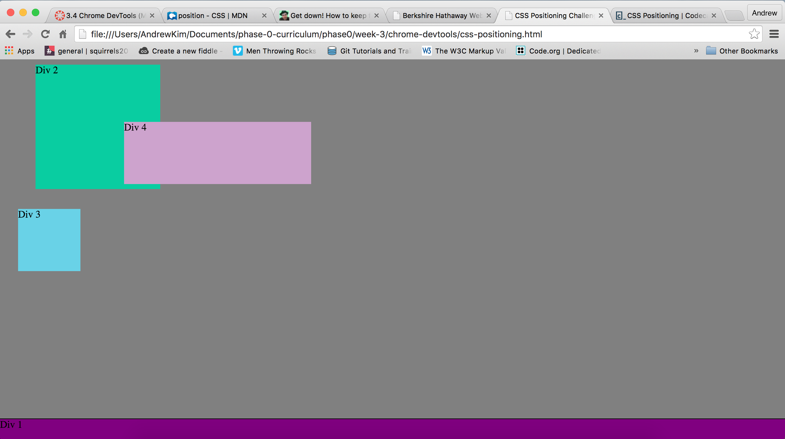
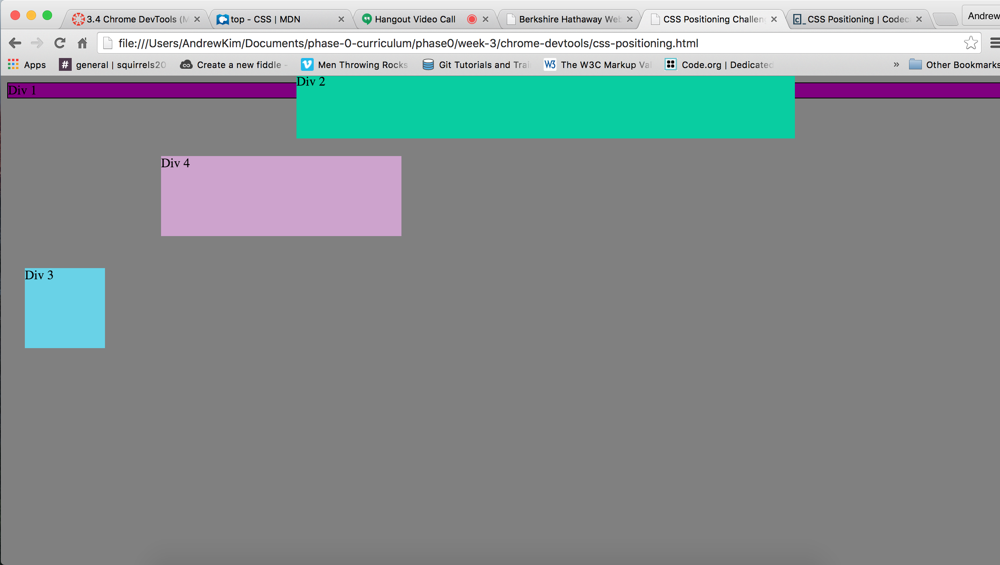
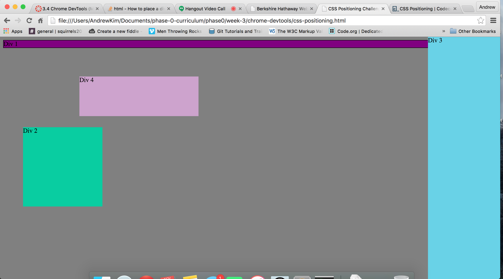
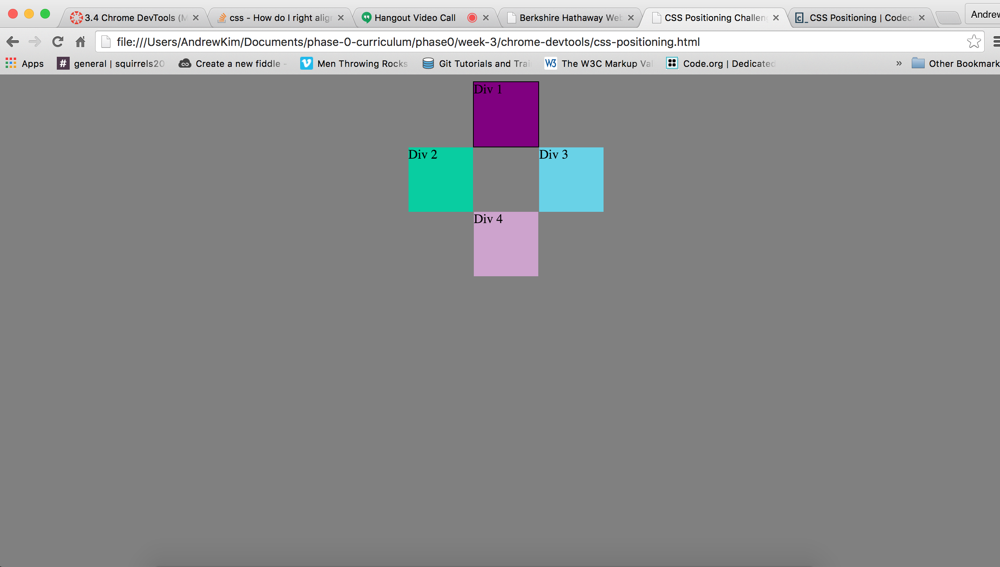

##This is my reflection entry for peer-pairing exercise 3.4.

###In this exercise, we manipulated the positioning of some div blocks and took screenshots of the result.  Below are my screenshots for each exercise:

###We were also asked to answer the following questions:

####How can you use Chrome's DevTools inspector to help you format or position elements?
I thought Chrome's DevTools was a great tool for positioning.  It was fast and easy to change and enter CSS commands and immediately see the result, plus the auto-complete was handy to see what values were available for each property entered.  So I would say that speed, ease-of-use, and display of available options were the main benefits for me.

####How can you resize elements on the DOM using CSS?
Resizing elements in the DOM is very simple.  First, right-click on the element you are trying to rize and select "Inspect Element".  In the Styles window where it says element.style, just type the height and width that you want between the curly braces.

####What are the differences between absolute, fixed, static, and relative positioning? Which did you find easiest to use? Which was most difficult?
Absolute positioning tells a block to go exactly where you tell it regardless of what else is in the way, and other blocks will position themselves as if the absolutely positioned block isn't even there.
Fixed positioning tells a block to be independent of other blocks on the screen, and will also stay in the same spot on your screen as you scroll.
Static positioning is the default positioning.  Static positioning lines blocks up based on the order they fall in the html code.  If everything is statically positioned, there isn't much you can do to control position other than playing with margins and padding.
Relative positioning moves a block relative to where it would normally go if you were using static positioning.  You can move the block without having to change the margin or padding of the block like you have to with static position.
Which was easiest and most difficult?  At this point I don't know if I found one to be easier or more difficult to use.  I just struggled to find the correct one to use to get the desired effect.  Sometimes the interaction of other divs around the div that I was positioning was surprising.  I think as I use this more it will become easier to understand.

####What are the differences between margin, border, and padding?
These are essentially three different areas that surround the content of a block.
Margin is the outermost area.  It separates the border from other objects.
Border is the middle area. It separates the margin from the padding.
Padding is the inner area.  It separates the border from the content.
Each of these areas can have a thickness, or no thickness at all.

####What was your impression of this challenge overall? (love, hate, and why?)
I definitely liked this challenge.  Most of the exercises were very simple, a few were very challenging for my pair and I, especially exercise 8.  I loved it because I learned some things about how blocks interact with each other, and the interaction sometimes didn't make sense at first.  It was a great learning exercise and although I admit that I do not fully understand all of the interactions, it will become more clear as time goes on.
