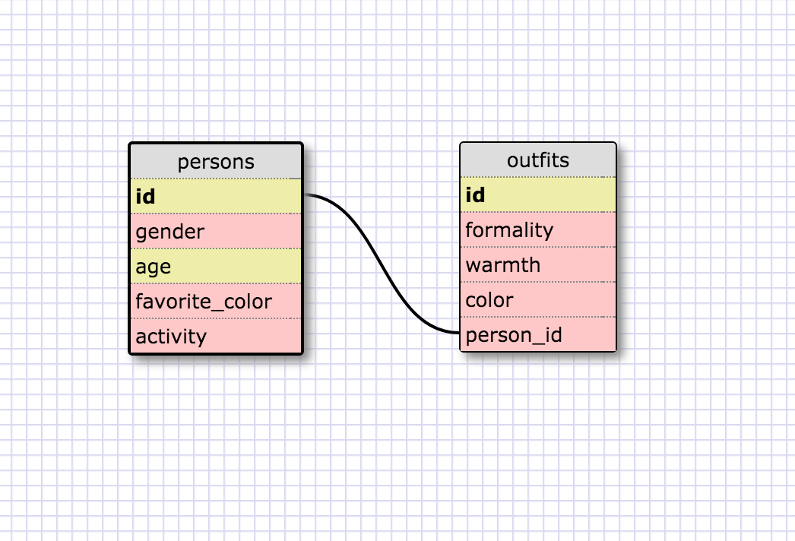

## 8.4 Reflection:

###What are databases for?
Databases store large amounts of information in a way that makes it easily accessable.

###What is a one-to-many relationship?
A one-to-many relationship is one where you have items in one table that correspond to several items in another table.  For example, if you have a 'persons' table and a 'cars' table.  There might be people who own several cars and some who own none.

###What is a primary key? What is a foreign key? How can you determine which is which?
A primary key is a key that is unique to that table.  There will be no two items on the table that have the same primary key.  A foreign key is a field in a table that correspondes to a field in another table.  You can tell the difference because the primary key is typically named 'id', and a foreign key typically references the name of the table that it refers to.

###How can you select information out of a SQL database? What are some general guidelines for that?
There are a library of commands available for selecting information.  The main one is SELECT, but here is a list of common commands:

SELECT is the clause you use every time you want to query information from a database.
WHERE is a popular command that lets you filter the results of the query based on conditions that you specify.
LIKE and BETWEEN are special operators that can be used in a WHERE clause
AND and OR are special operators that you can use with WHERE to filter the query on two or more conditions.
ORDER BY lets you sort the results of the query in either ascending or descending order.
LIMIT lets you specify the maximum number of rows that the query will return. This is especially important in large tables that have thousands or even millions of rows.

### Here is the screenshot of my Schema design:

