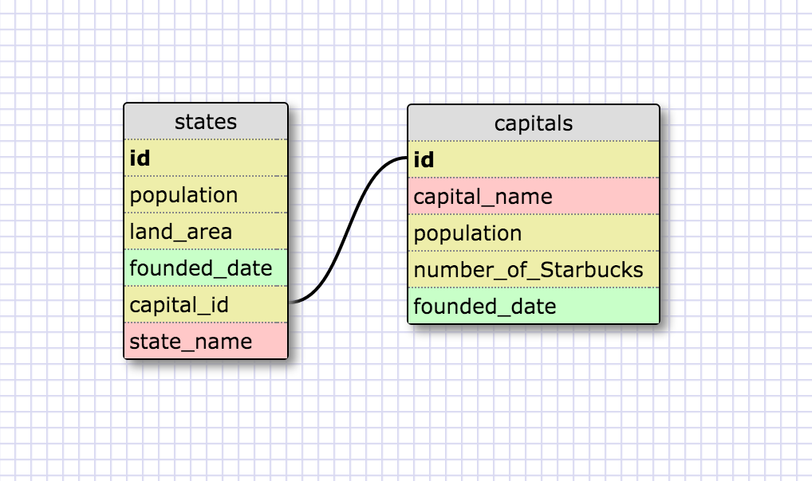
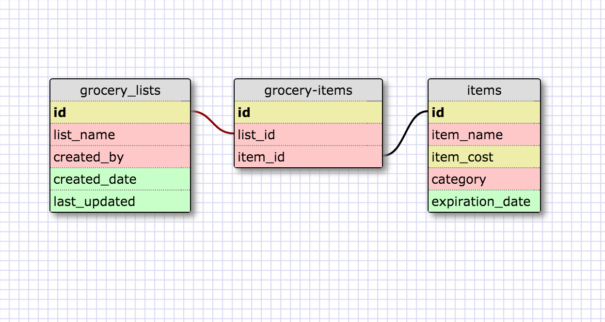

## 8.5 Reflection:

###What is a one-to-one database?
A one-to-one database is one where you have tables that are linked through a foreign key and each item in one table is related to only one item in the other table and vice-versa.

###When would you use a one-to-one database? (Think generally, not in terms of the example you created).
A general rule of thumb is that you would use a one-to-one when you have data with fields that can potentially be empty.

###What is a many-to-many database?
A many-to-many database is one where you have tables where multiple items in one table can be linked to multiple items in another table.

###When would you use a many-to-many database? (Think generally, not in terms of the example you created).
A many to many database is useful when you have items in one table that can be related to multiple items in another table and vice versa.

###What is confusing about database schemas? What makes sense?
All of this makes sense to me right now.  I'm sure some things might get confusing when working with huge databases with tens or hundreds of tables each containing tens or hundreds of fields.

##Schemas:

One-to-One:

Many-to-Many:

